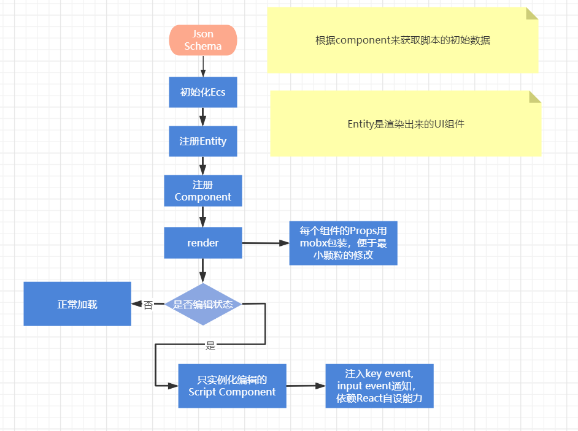

TODO

1. mobx调整react组件，做原子操作，提供保存按钮更新到schema
2. 调整代码结构
3. 实现新增组件的能力
4. 这里改造成id，通过id在manager那里去查，调整组件与实体的映射关系

## 核心能力
利用ECS架构，划分`Component` `ReactComponent` `Entity`,通过`json schema` 来进行整合与渲染

## flow

## 组件划分
1. Component脚本组件，主要在`src/script`内，通过
`_c.registerEntity("panel", Panel)` 来注册，主要给UI组件提供能力